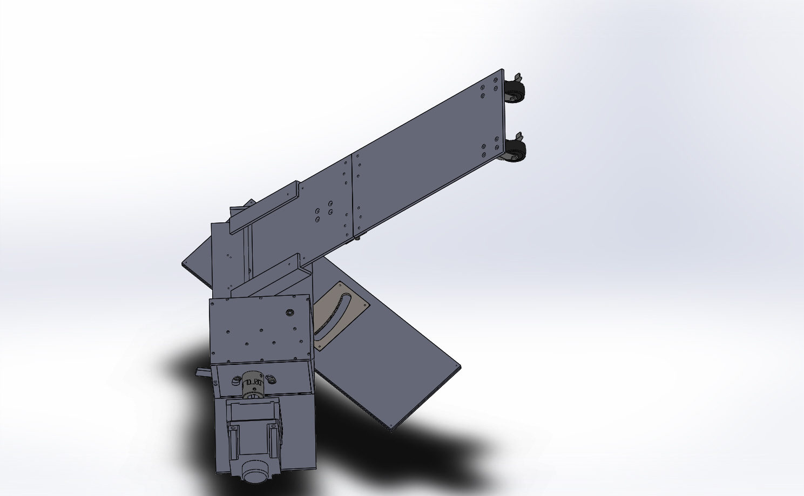

My senior capstone project at Columbia was a continuous passive motion machine intended for post-operative hip joint rehabilitation. A continuous passive motion machine provides continuous actuation of a joint without requiring a patient to lift the weight of that joint. Medical studies in various joints have demonstrated that the motion of a joint after certain surgical procedures can significantly reduce the time it takes to heal. There already exist at-home machines for continuous passive motion of the knee, which only actuates in one plane of motion. However, at the time of our project, no portable machines existed for at-home use during hip rehabilitation. Our goal was to design and prototype a machine that could actuate the hip muscle in at least two of its three planes of motion.

###The Design
The design we arrived on as a group was composed of 4 main mechanical components:
1. A platform that would support the entirety of the mechanism. This platform was comprised of several sheets that could slide relative to one another to provide abduction and adduction.
2. A leg-rest mounted to the platform that would hold the leg during motion. This leg-rest actuated in the flexion and extension plane, essentially bending and extending the leg.
3. A single, strong electric motor that would provide actuating forces to the system.
4. A gearbox that would take power from the motor and transmit it to either the flexion-extension mechanism or the abduction-adduction mechanism. The gearbox would be able to switch between the two modes of operation.

The CAD model following this plan looked as follows:

###The Prototype
The CAD model was turned into a working prototype over the course of several months. The final prototype was comprised of mostly machined aluminum parts, laser cut acrylic sheets, and purchased materials. The gearbox was all custom built, using machined gears, shafts, and retaining walls. The machine could be actuated in one of two planes of motion, depending on the position of an adjustable lever. Motor control was accomplished through a custom transistor circuit on a breadboard which allowed an Arduino Uno to interface with the controller for the motor we chose.

<iframe style="display:block; margin:0 auto;" width="560" height="315" src="https://www.youtube.com/embed/kLnHmWBydFs" frameborder="0" allow="autoplay; encrypted-media" allowfullscreen></iframe>