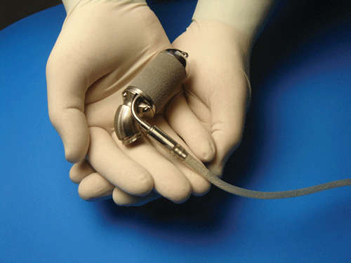

###What I Did
Jarvik Heart, Inc. (JHI) is a medical device manufacturer in New York City that manufactures and sells Ventricular Assist Systems (VAS) internationally. Below is a picture of the pump:

I worked with the manufacturing team to reduce scrap and lower process times, thereby improving production output. To this end, we utilized lean manufacturing principles and tools. We implemented a Kanban system, analyzed processes with pFMEA, and addressed failure modes with various tools such as Poka Yoke.

I interfaced with outside suppliers to improve the quality of incoming items. I was the primary point of contact to several suppliers, and was able to manage the completion of various inter-company projects. In one major project, I oversaw the creation of a new master mold for a resin casting process at a key supplier for JHI's controller production. I was able to significantly reduce the scrap rate for this critical component and reduce dimensional variation in the part. This led to significant downstream productivity increases and higher final product quality.

One of my major roles as a manufacturing engineer was to manage the machine shops. I was responsible for queueing jobs for the shops, addressing quality issues, and addressing machining issues. I was responsible for taking in and prioritizing the full list of necessary machining jobs for JHI's pump production, controller production, battery production, and R&D needs. I was also responsible for ensuring process times were decreased and machine shop productivity was increased.

###What I Learned
The time I spent as a manufacturing engineer at JHI was extremely transformative. I learned about medical device manufacturing under ISO 13485:2016 and FDA's CFR Title 21 Part 820. I developed a working vocabulary for manufacturing  and became very well versed in machining. I was able to develop managerial skills, project management skills, and a persistent sense of continuous improvement. I learned to gauge the value of engineering work both from the perspective of the business and from the perspective of the end user.

Working as a manufacturing engineer also helped me realize a more specific interest within the medical devices industry. As much as I enjoyed my time as a manufacturing engineer, I realized that my true interests lied in design and development.