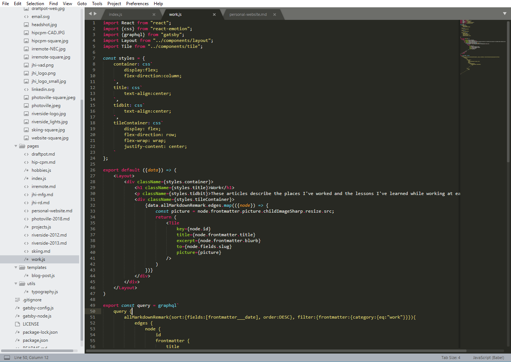

This website was built using the framework established by Gatsby.js. Gatsby.js allows developers to create static webpages using the powerful templating tools in React.js and the powerful API/database tools in GraphQL. All the components of this website were custom built and styled by me.

I debated whether or not to use a service like Squarespace or Wix to quickly develop a portfolio site using drag-and-drop tools, but ultimately realized that I had all the necessary skills to do it myself. This way, I have intimate control over how everything looks. I can put a personal flair on the website that might not be available through other services. Feel free to check back over time and look at the changes I've made.

The github repository can be found <a href="https://github.com/mdermksian/mdermksian" style="color:blue;" target="_blank" rel="noopener noreferrer">here</a>.