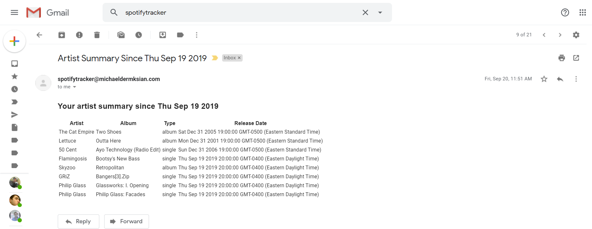

I love music and get a lot of joy out of following specific artists and listening to their new releases. I have always been disappointed with Spotify's release notifications. I've missed new music many times because the algorithm Spotify uses to determine which artists I'm interested in is imprecise. I'm always disappointed when I find out one of my favorite artists put out new music and I missed it!

This project was my attempt to circumvent Spotify's service and build my own. Over the course of a few weeks in the summer of 2019, I built a Node.js web server that would track a list of artists I'm interested in. Every night, it crawls through Spotify's web API and checks their record of arists' albums. If that record differs from mine (indicating a new release), it notifies me by email in the morning:

As of now there's no front end and I have to interact with my server via Postman (a tool for sending http requests), but one day I'd love to build a little web interface and allow others to track their artists as well. For now though, I've finally ensured I'll never miss a new release. All the source code can be found on Github <a href="https://github.com/mdermksian/spotify-tracker" style="color:blue;" target="_blank" rel="noopener noreferrer">here</a>.