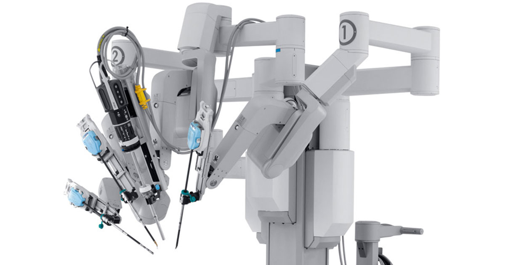

### What I Did
In the summer of 2020 (at the height of the COVID-19 pandemic) I had the opportunity of working with Intuitive, Inc as part of their summer internship program. Intuitive designs, develops, and manufactures robotic medical systems such as daVinci and Ion. I worked remotely with their team in Orange, CT designing concepts for new instruments to be used on the daVinci. Over the course of the summer I modeled prototypes for a new instrument, modeled industrial design concepts, and designed and assembled a test fixture for evaluation of instrument performance.

I interfaced extensively with many of teams at Intuitive, including their industrial designers, clinical engineers, manufacturing engineers, and system analysts. Each had unique stakes in the development of the instrument that my team and I worked to integrate into our prototype designs.

### What I Learned
My past experiences at Jarvik Heart gave me a lot of insight into how a small, scrappy team of engineers can work to develop medical devices. Intuitive provided insight into the opposite end of the spectrum. Intuitive has many large teams that are capable of specializing in a specific area of development. They also manage many products with thousands of component parts. Their outstanding company culture enables their teams to work efficiently and with a mindset of continuous improvement. They have successfully managed to scale in such a way that efficiency is maintained and the voice of the individual employee is not lost.

Working at Intuitive also reaffirmed that my current career path is personally gratifying and exciting. I will continue to pursue opportunities in this space as I move forward in my career.