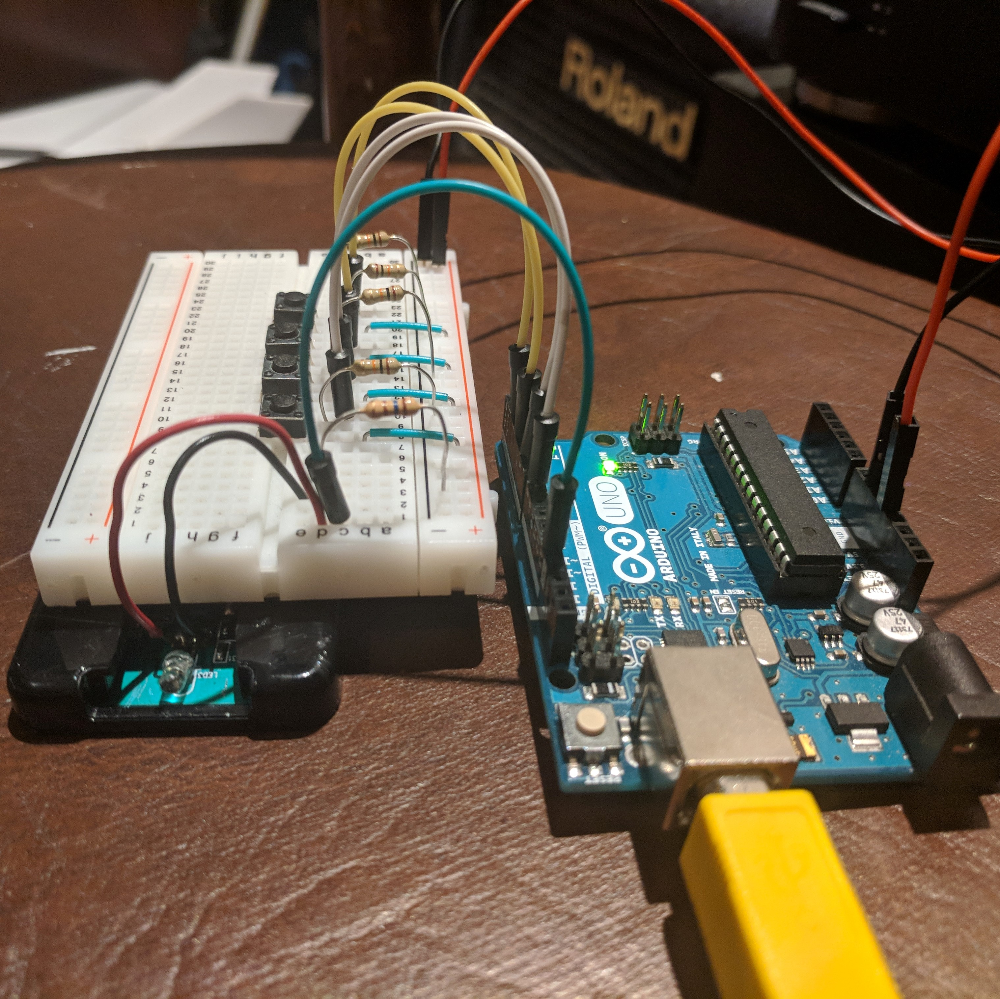
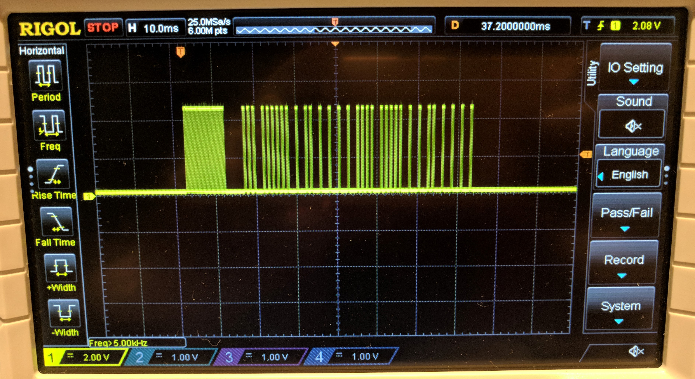

After living in Brooklyn for a year, my roommates moved out and left me with a nice HDTV that was missing a remote. It was a good opportunity to learn a bit about infrared (IR) communication and try building my own remote control. The TV was an older VIZIO model, and after a bit of research I learned that VIZIO uses the NEC protocol for its infrared communication. I set out to define my necessary design inputs:
1. The remote must be able to turn the TV on/off.
2. The remote must be able to turn the volume up/down.
3. The remote must be able to change inputs.
4. The remote must be able to function on battery supply.

I don't use the TV for watching normal TV, so I had no use for channel control or the majority of the other TV-related functions.

#### The Remote Construction
In order to accomplish the above requirements, I decided to use an Arduino Uno and an old IR remote that I had lying around my room. I opened the remote and patched into the IR LED via an Arduino output. The Arduino would listen for inputs from four buttons on a breadboard (ON/OFF, Vol Up, Vol Dn, and Input) and then output the proper encoded message to the LED. The Arduino was programmed via the normal computer IDE and was then powered with a 9V battery. This is a picture of the construction with the Arduino powered over USB:

#### The NEC Protocol
The real work in this project was to encode the proper message into the NEC infrared protocol for transmission. A significant amount of digging online uncovered the messages I needed to send, and the form they would take in the NEC protocol. NEC is surprisingly simple. The protocol operates with a 38kHz carrier frequency. A logical "1" is a 2.25ms interval that begins with a 560µs burst of the carrier frequency. A logical "0" is a 1.125ms interval that begins with a 560µs burst of the carrier frequency. A message is comprised of an address and a command - each 8 bits - encoded in 5 parts:
1. The message always starts with a 9ms burst of the 38kHz carrier frequency followed by a 4.5ms quiet interval.
2. The 8 bits of the address are transmitted with the least significant bit first.
3. The inverse of the address is transmitted.
4. The 8 bits of the command are transmitted with the least significant bit first.
5. The inverse of the command is transmitted.

For my VIZIO TV, the address was 0x04 (0xFB being the inverse of the address) and the power command was 0x08 (0xF7 being the inverse of the command. When translated into the format described above, this results in a message that looks as follows (obtained from my oscilloscope):

And it worked! I was able to successfully control my TV wirelessly with little more than an Arduino and an infrared LED.

