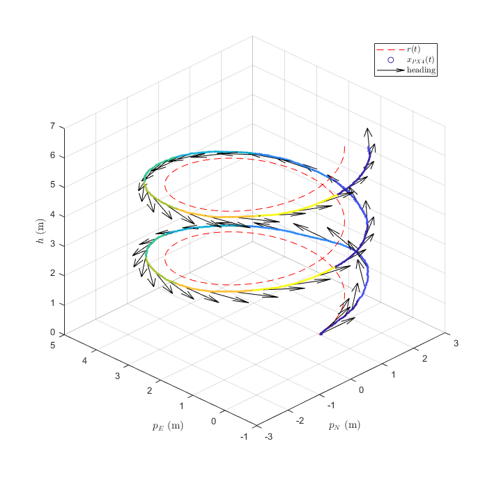

For 24-776 Nonlinear Control, a teammate and I investigated the applicability of gain scheduled LQR control with integral action to a quadrotor. A single LQR controller is designed for a system linearized about an specific yaw angle. Such a controller is incapable of stabilizing the system at yaw angles far from the operating point. We therefore design many linear controllers for yaw angles that describe the vehicle's full range of motion, and select an appropriate controller based on the robot's current pose.

Additionally, a simple LQR controller is inadequate for tracking control because it can only asymptotically track a step input without an integrator. Adding integral action allows the robot to asymptotically track a ramp, and improves performance when tracking more complex reference signals. We investigated the capability of the controller to track several trajectories: a ramp, a helix, and a Lissajous curve. We also investigated the performance of three different scheduling methods:
1. Discrete stepped regions
2. Continuous linearly interpolated regions
3. Continuous, smooth fitted functions

The controller was implemented and simulated using PX4 and jMAVsim. Sensor data was collected from the simulation and the trajectories were plotted against the reference trajectory. Below is an example of the linearly interpolated gain scheduler tracking a helix. Different colors indicate that the gain scheduler is operating in different regions. The black arrows indicate the heading of the vehicle.

We found that the best tracking performance can be achieved by fitting continuously smooth functions of the scheduling variable to each element of the gain matrix. The lack of discontinuities of this type of controller prevents oscillations that result from switching regions (as observed in the stepped scheduler).

An in-depth PDF writeup of our results and methods <PostLink href="/quadcopter-report.pdf">can be found here</PostLink>. Code for controller implementation can be found on <PostLink href="https://github.com/mdermksian/nonlinear-project" target="_blank" rel="noopener noreferrer"> my Github page.</PostLink>