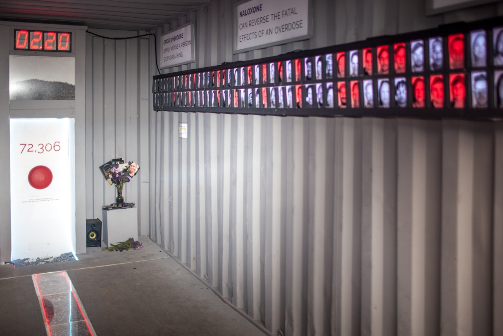

Photoville is a yearly photography expo that goes on in Brooklyn Bridge Park. Luceo Images was doing an exhibit highlighting the rate of overdose in the United States. This number has been climbing exponentially for years, and is reaching catastrophic levels. Roughly 64,000 people died in 2016 and over 72,000 died in 2017. This amounts to one person every 7 minutes and 19 seconds.

To bring awareness this tragic fact, Luceo came up with the idea for a photography exhibit in which every 7 minutes and 18 seconds a ball would drop onto a bell and fall into a river of metal balls representing the countless people who have died from drug overdoses. With each bell ring, one of the 200 portraits lining the walls would turn red. The following is a picture of the final exhibit:

### Engineering Inputs
Luceo brought a friend and me in to implement the engineering components needed to make the exhibit function. They had purchased a motor and controller, but needed help getting them running and integrated into the system. The motor was used to grab a ball bearing from a hopper and drop it precisely down onto the bell. It was my responsibility to ensure that the mechanics of the ball drop were repeatable over the course of the two weeks of the exhibit.

I designed a circuit to control the motor from the Arduino with a simple MOSFET enable. As the motor rotated, a small component attached to the shaft would pick up a ball and drop it down. A funnel placed below the rotating shaft would ensured that the ball would feed directly down onto the bell without any horizontal movement. All timing of the motor control was handled relative to the rest of the exhibit by a single Arduino Mega. Below is the finished circuitry running off of an Arduino Uno for testing:

<Video src="https://www.youtube.com/embed/r7Fij_WeVbg" title="photoville-2018" />