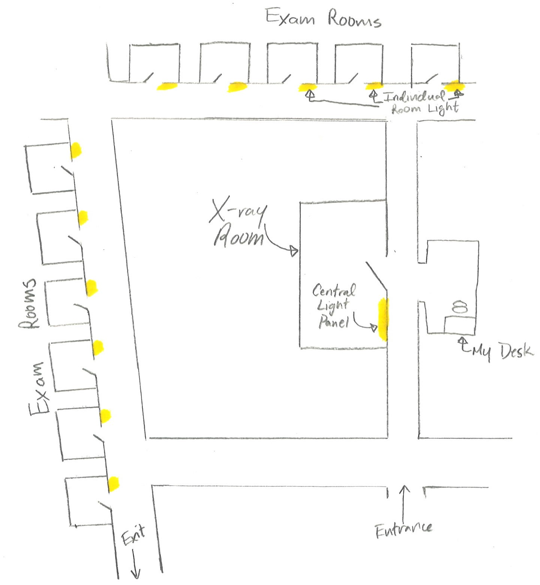

### What I Did
My first work position was a summer in 2012 at Riverside Orthopaedic and Sports Medicine in New York City. I worked as a medical assistant for this orthopedic practice of 6 physicians in midtown Manhattan. My primary role was to transport patients from their examination room to one of the x-ray rooms and back in order to help the doctors streamline the patient examination process. Simplifying and organizing the x-ray process would increase doctor efficiency and reduce wait time for patients.

The doctors used a simple light system to manage communication between the patient and the x-ray technician. Each room had a button that, when pressed, lit up a corresponding light in the x-ray room to indicate to the technician that a patient needs to be seen. It was my responsibility to respond to the lights, identify which patient needed to be prioritized, and bring them to the technician to be examined.

One of the key inefficiencies that I identified right away was in the light system itself. Each of the doctors had access to the individual buttons for each examination room and only the x-ray technician had the panel of lights that provided a full overview of the rooms. As such, there was no way for me to identify when a new patient was added to the x-ray queue if a patient was being seen by the technician. In this scenario, I would be forced to walk the halls of the practice, constantly polling the individual lights of the examination rooms to try to identify when new patients were added to the list. The floor schematic sketch below should illustrate this problem:

When the door to the x-ray room was closed, I had no visibility on the overall status of the light system. To address this without any additional cost to the practice, I called the company that distributes the light system, and worked with them to implement a networked solution for the practice. Anyone on the company’s network would be able to view the status of each light from their computer within their browser. With this tool, it no longer was necessary to repeatedly poll the rooms. I could use this time to help the office manager with various other tasks.

### What I Learned
This job at Riverside Orthopaedic was my first paid work position. I learned a great deal about medical practices, how they work, and how to make them more efficient. I developed interpersonal skills in speaking to patients and interfacing with the light system distributor. It became clear to me that when a problem arises, so does a choice: one can choose to tackle the problem and implement a solution or ignore the problem and go on with the status quo. It is always worthwhile to choose to put the extra effort in to solve the problem.